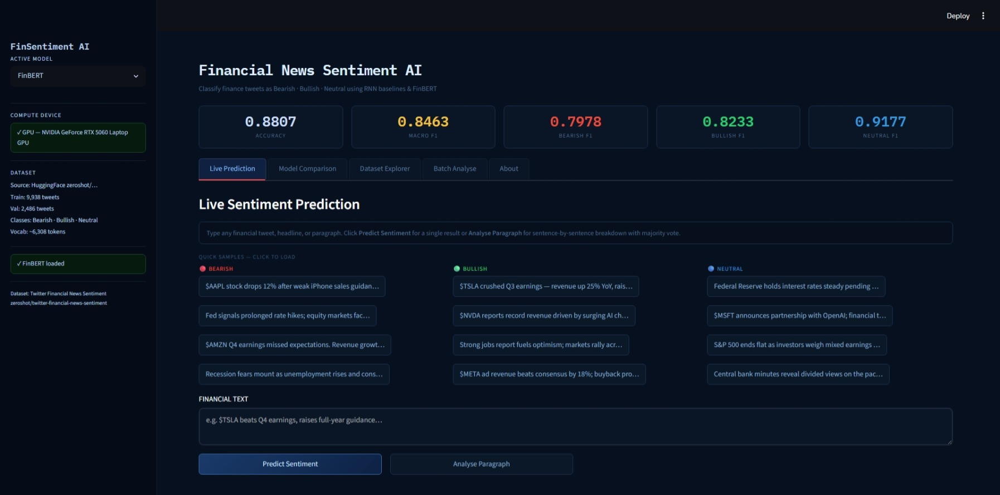

<!--
---
title: Financial Sentiment Dashboard
emoji: 📈
colorFrom: blue
colorTo: gray
sdk: docker
app_port: 7860
pinned: false
models: 
- ProsusAI/finbert
- ntini97/financial-sentiment-models
---
-->

# Financial News Sentiment Prediction using Deep Learning & FinBERT

A production-ready sentiment classification system that classifies finance-related news and tweets into **Bearish 🔴**, **Bullish 🟢**, or **Neutral 🔵** using deep learning and transformer-based models.

The project implements three RNN-based baseline models (**SimpleRNN**, **LSTM**, and **GRU**) and fine-tunes **FinBERT (ProsusAI/finbert)** to achieve state-of-the-art performance on financial sentiment analysis. An interactive Streamlit dashboard is included for real-time sentiment prediction.

**Live Demo:** https://ntini97-financial-sentiment-dashboard.hf.space/

---


## Project Structure

```text
financial-news-sentiment/
│
├── .dockerignore                                               ← Docker ignore rules
├── .gitignore                                                  ← Git ignore rules
├── Dockerfile                                                  ← Docker configuration
├── requirements.txt                                            ← Python dependencies
│
├── app.py                                                      ← Streamlit dashboard
├── export_vocab.py                                             ← Exports tokenizer vocabulary for the dashboard
│
├── Financial_News_Sentiment_Prediction_Complete.ipynb          ← End-to-end notebook (EDA, preprocessing, model training & evaluation)
│                                  
│
├── project_report.md                                           ← Detailed project report
├── README.md                                                   ← Project documentation
│
├── Assets/                                                     ← Images and other static assets
│
├── models/                                                     ← Saved trained models and tokenizer files
│
└── .vscode/                                                    ← VS Code workspace settings (optional)
```

**Note:** The `models/` directory is **not included** in this repository because it contains large trained model weights (e.g., a fine-tuned FinBERT model of approximately 500 MB). Run the notebook to train the models and generate the required files locally before launching the Streamlit application.

---

## Setup & Installation

### 1. Clone the repository

```bash
git clone https://github.com/nithansantiago021/Financial-News-Sentiment-Prediction-using-Deep-Learning-BERT.git
cd Financial-News-Sentiment-Prediction-using-Deep-Learning-BERT
```

### 2. Create a virtual environment (recommended)

```bash
python -m venv venv
source venv/bin/activate        # Linux / macOS
venv\Scripts\activate           # Windows
```

### 3. Install dependencies

```bash
pip install -r requirements.txt
```
---

## How to Run

### Step 1 — Train all models (notebook)

Open and run every cell in the notebook from top to bottom:

```bash
jupyter notebook Financial_News_Sentiment_Prediction_Complete.ipynb
```

This will:
- Download the dataset from HuggingFace automatically
- Preprocess tweets with the full cleaning pipeline
- Train SimpleRNN, LSTM, and GRU with early stopping
- Fine-tune FinBERT (GPU recommended; pre-recorded results used on CPU)
- Save model weights to `models/`

### Step 2 — Export vocabulary

```bash
python export_vocab.py
```

This rebuilds the word→index mapping using the exact same pipeline as the notebook and saves it to `models/vocab.json`. The dashboard needs this file to convert new text to integers at inference time.

```bash
# Optional: verify vocab is consistent with saved model weights
python export_vocab.py --verify
```

### Step 3 — Launch the Streamlit dashboard

```bash
streamlit run app.py
```


---